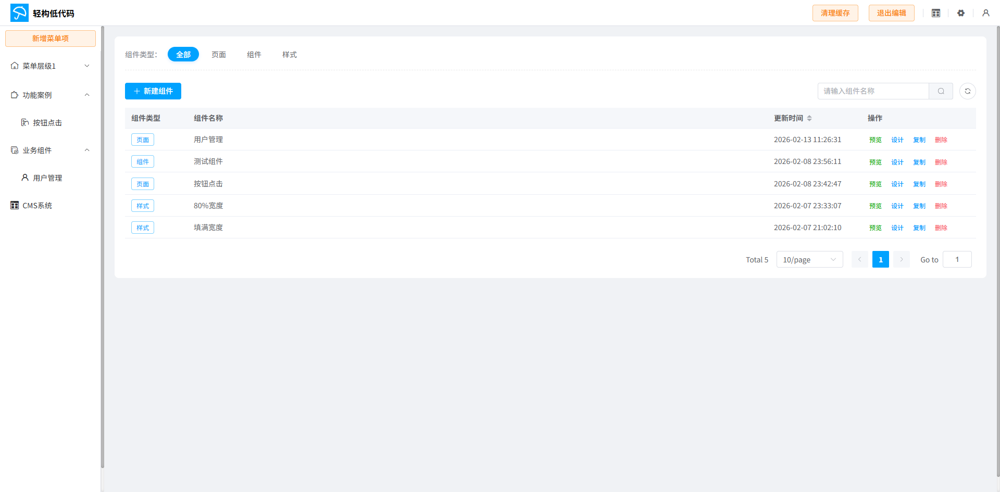
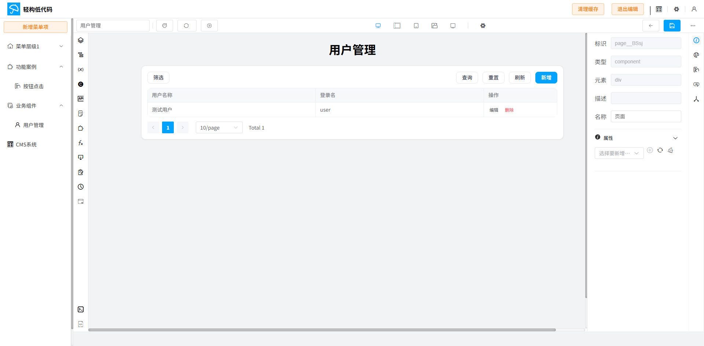
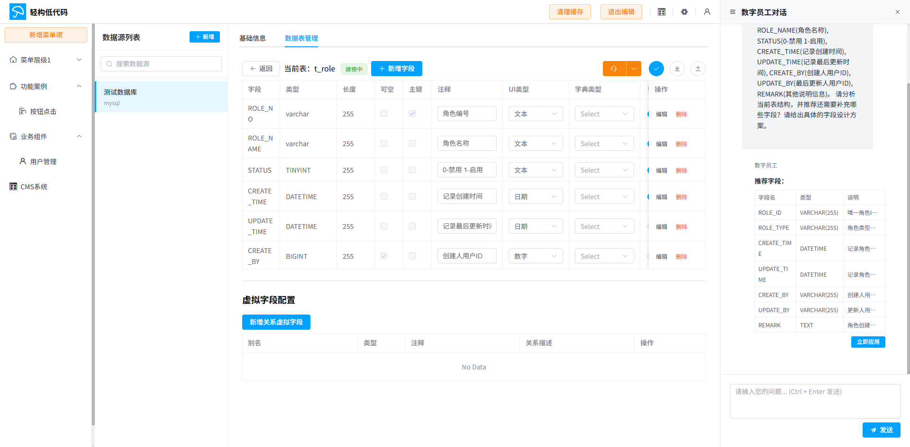
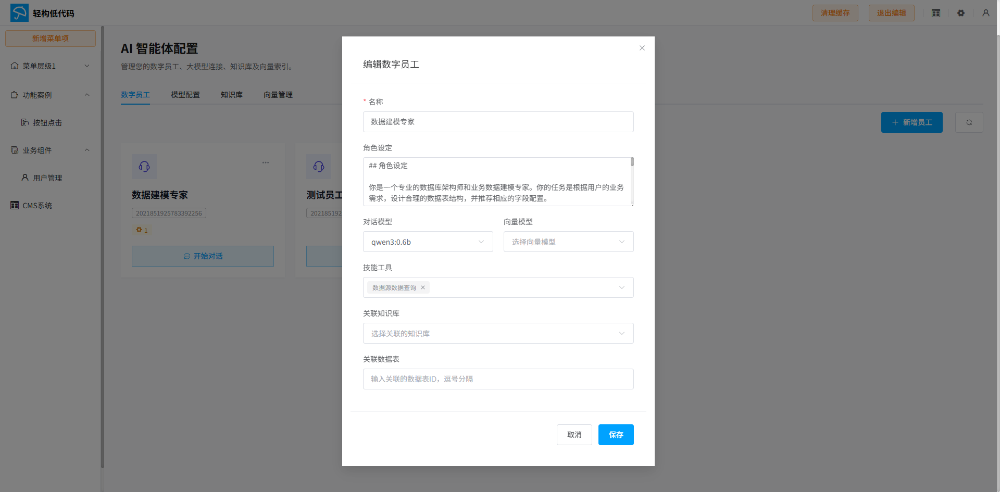

# Lightbuild

> **Everything is a Component.**

English | [简体中文](./README.md)

Lightbuild (Chinese: 轻构) is a next-generation low-code platform designed to redefine how we build applications. By treating everything—styles, pages, UI elements, and even logic—as composable components, Lightbuild offers unparalleled flexibility and efficiency.

---

## 💡 Philosophy

**"Everything is a Component"** is not just a slogan; it's our core architecture.
- **Visual Components**: Standard Vue components, strictly typed and easily reusable.
- **Logic Components**: Business logic encapsulated into manageable units.
- **Style Components**: Design tokens and themes that can be mixed and matched.

## ✨ Key Features

- **Visual Interface Builder**: Drag-and-drop interface with deep customization capabilities.
- **AI-Powered Development**: Integrated with Spring AI and Neo4j for intelligent vector-based search and assistance.
- **Process Automation**: Built-in BPMN engine for complex workflow orchestration.
- **Code-Level Control**: Embedded CodeMirror editors for when you need to dive into the details (Java, SQL, JSON, Vue support).
- **Data Visualization**: Powerful charting capabilities powered by AntV X6.

---

## Screenshots










---

## 🚀 Getting Started

You can spin up the entire stack using Docker Compose.

### Prerequisites

- Docker & Docker Compose
- Java 17+ (for local development)
- Node.js 18+ & pnpm (for frontend development)

### Run with Docker

```bash
cd docker
docker-compose up -d
```

### Local Development

**Server**
```bash
cd lightbuild-server
mvn clean install
# Run LightbuildServerApplication
```

**Web**
```bash
cd lightbuild-web
pnpm install
pnpm dev
```